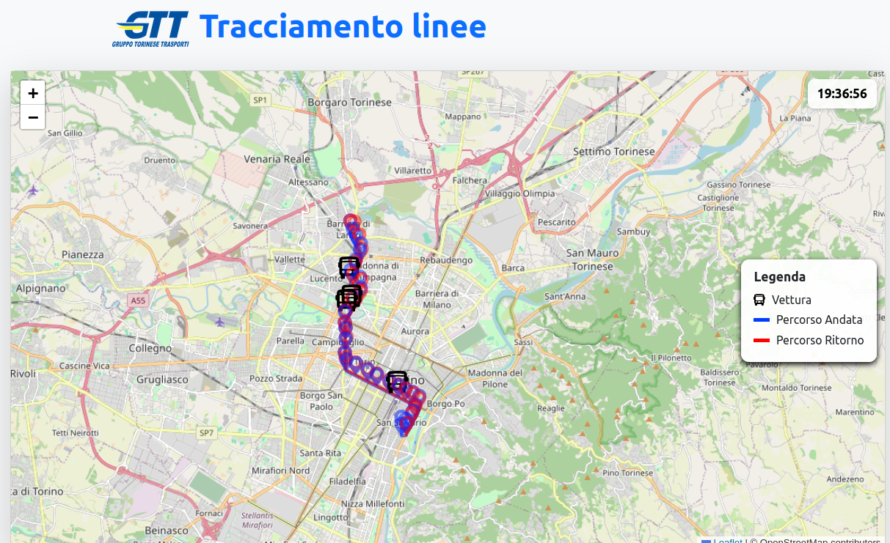

# GTT

Il progetto **GTT** permette di visualizzare in tempo reale i bus delle linee GTT sulla mappa della città di Torino.  Una volta selezionata la linea di interesse, è possibile esplorare sia il percorso di andata sia quello di ritorno, con tutte le fermate intermedie evidenziate direttamente sulla mappa.



---

## Architettura generale

L’infrastruttura è composta da due componenti principali:

- **Frontend (`fe-gtt`)**
  - Applicazione sviluppata in **React**.
  - Servita in produzione tramite **Nginx**, esposta sulla porta `80`.
  - Responsabile della visualizzazione della mappa, dei percorsi e dei mezzi in tempo reale.

- **Backend (`be-gtt`)**
  - Servizio scritto in **Go**.
  - Espone una **REST API** sulla porta `8080`.
  - Fornisce al frontend i dati sui mezzi, le linee, i percorsi e le fermate.

Entrambi i servizi sono containerizzati e orchestrati tramite **Docker Compose**.  
I container comunicano all’interno di una rete dedicata (`gtt-net`).

Le immagini sono disponibili su Docker Hub:  
- Frontend → [giorgiodaniele/fe-gtt](https://hub.docker.com/repository/docker/giorgiodaniele/fe-gtt)  
- Backend → [giorgiodaniele/be-gtt](https://hub.docker.com/repository/docker/giorgiodaniele/be-gtt)  

---

## Avvio dell’infrastruttura

Per avviare l’intero progetto è sufficiente utilizzare **Docker Compose** dalla root della repo:

```bash
docker compose up -d
```